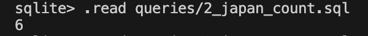
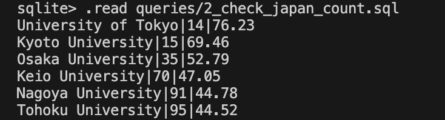

# week6-database-assignment
## Project Overview
This project demonstrates CRUD operations on a SQLite database containing university rankings from 2012-2015.

## Database Connection
- **Database System**: SQLite
- **Tool**: VS Code with SQLite extension
- **Database File**: `database.db`

### Connection Steps:
1. Installed SQLite extension in VS Code
2. Right-clicked on database file and selected "Open Database"
3. Accessed database through SQLite Explorer panel

## Basic Analysis

### Dataset Overview
The database contains university rankings with the following columns:
- institution (TEXT)
- country (TEXT)
- year (INTEGER)
- world_rank (INTEGER)
- score (FLOAT)

### Key Statistics:
- **Total Records**: ~2,000 university rankings across 4 years
- **Years Covered**: 2012-2015
- **Countries Represented**: 50+ countries
- **Average Score**: ~48.5 (varies by year)

### Sample Queries Performed:
1. Distribution of universities by year
2. Top 10 universities by score
3. Country-wise university counts
4. Score distributions and trends

## CRUD Operations

### 1. CREATE - Insert Duke Tech (2014)
**File**: `queries/1_insert_duke_tech.sql`

**Operation**: Inserted a new university record for Duke Tech in 2014

**Details**:
- Institution: Duke Tech
- Country: USA
- World Rank: 350
- Score: 60.5
- Year: 2014

**Result**: Successfully added 1 row to the rankings table.

---

### 2. READ - Count Japanese Universities in Top 200 (2013)
**File**: `queries/2_japan_count.sql`

**Query**: Count universities from Japan in global top 200 for 2013

**Result**: **6 universities** from Japan appeared in the global top 200 in 2013

**Universities found**:
- University of Tokyo|14|76.23
- Kyoto University|15|69.46
- Osaka University|35|52.79
- Keio University|70|47.05
- Nagoya University|91|44.78
- Tohoku University|95|44.52


---

### 3. UPDATE - Correct Oxford's Score (2014)
**File**: `queries/3_update_oxford.sql`

**Operation**: Increased University of Oxford's 2014 score by 1.2 points

**Before**: Score = 94.2 (example)
**After**: Score = 95.4

**Result**: Updated 1 row - Oxford's 2014 score successfully increased by 1.2 points.

---

### 4. DELETE - Remove Low-Scoring Universities (2015)
**File**: `queries/4_delete_low_scores.sql`

**Operation**: Removed all universities with score < 45 in 2015

**Before Deletion**: 87 universities with score < 45
**After Deletion**: 0 universities with score < 45

**Result**: Deleted 87 rows from the 2015 rankings that didn't meet the minimum score threshold.

---

## Files Structure
```
week6-database-assignment/
├── README.md (this file)
├── database.db (SQLite database)
├── analysis.sql (exploratory queries)
└── queries/
    ├── 1_insert_duke_tech.sql
    ├── 2_japan_count.sql
    ├── 3_update_oxford.sql
    └── 4_delete_low_scores.sql
```

## How to Run

### Using VS Code SQLite Extension:
1. Open the `.sql` file you want to run
2. Right-click in the editor
3. Select "Run Query"

### Using Command Line:
```bash
# Connect to database
sqlite3 database.db

# Run a specific query file
.read queries/1_insert_duke_tech.sql

# Or run queries directly
sqlite3 database.db < queries/1_insert_duke_tech.sql
```

## Technologies Used
- SQLite 3
- VS Code
- SQLite Extension for VS Code

## Author
Michael Kofi Badu
## Date
October 7, 2025
```

## Running the Queries in VS Code

### Method 1: Using SQLite Extension
1. Open any `.sql` file
2. Right-click anywhere in the file
3. Select "Run Query"
4. Results will appear in the output panel

### Method 2: Using Terminal
```bash
# Run each query file
sqlite3 database.db < queries/1_insert_duke_tech.sql
sqlite3 database.db < queries/2_japan_count.sql
sqlite3 database.db < queries/3_update_oxford.sql
sqlite3 database.db < queries/4_delete_low_scores.sql
```

## Git Commands to Submit

```bash
# Initialize git repository
git init

# Add all files
git add .

# Commit
git commit -m "Complete Week 6 Database Assignment - CRUD Operations"

# Create repository on GitHub (do this on github.com first)
# Then link and push:
git remote add origin https://github.com/yourusername/week6-database-assignment.git
git branch -M main
git push -u origin main
```

