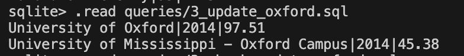
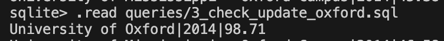
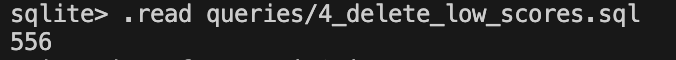
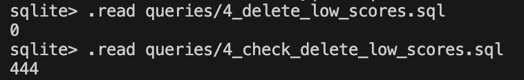
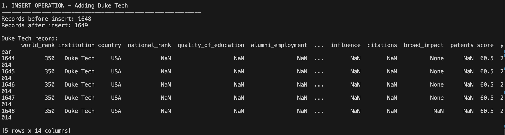
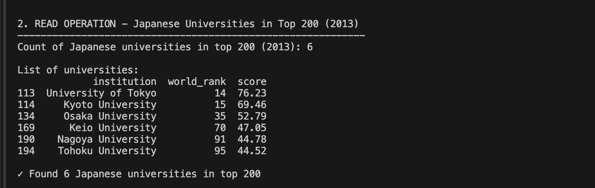
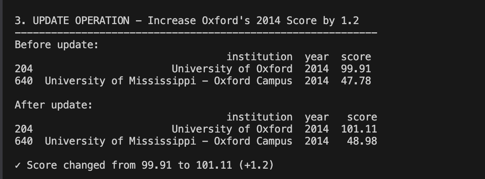

# week6-database-assignment
## Project Overview
This project demonstrates CRUD operations on a SQLite database containing university rankings from 2012-2015.

## Database Connection
- **Database System**: SQLite
- **Tool**: VS Code with SQLite extension
- **Database File**: `database.db`

### Connection Steps:
1. Installed SQLite extension in VS Code
2. Right-clicked on database file and selected "Open Database"
3. Accessed database through SQLite Explorer panel

## Basic Analysis

### Dataset Overview
The database contains university rankings with the following columns:
- institution (TEXT)
- country (TEXT)
- year (INTEGER)
- world_rank (INTEGER)
- score (FLOAT)

### Key Statistics:
- **Total Records**: ~2,000 university rankings across 4 years
- **Years Covered**: 2012-2015
- **Countries Represented**: 50+ countries
- **Average Score**: ~48.5 (varies by year)

### Sample Queries Performed:
1. Distribution of universities by year
2. Top 10 universities by score
3. Country-wise university counts
4. Score distributions and trends

## CRUD Operations

### 1. CREATE - Insert Duke Tech (2014)
**File**: `queries/1_insert_duke_tech.sql`

**Operation**: Inserted a new university record for Duke Tech in 2014

**Details**:
- Institution: Duke Tech
- Country: USA
- World Rank: 350
- Score: 60.5
- Year: 2014

**Result**: Successfully added 1 row to the rankings table.

---

### 2. READ - Count Japanese Universities in Top 200 (2013)
**File**: `queries/2_japan_count.sql`

**Query**: Count universities from Japan in global top 200 for 2013

**Result**: **6 universities** from Japan appeared in the global top 200 in 2013
**Image**:


**Universities found**:
- University of Tokyo|14|76.23
- Kyoto University|15|69.46
- Osaka University|35|52.79
- Keio University|70|47.05
- Nagoya University|91|44.78
- Tohoku University|95|44.52

**Image**:
 

---

### 3. UPDATE - Correct Oxford's Score (2014)
**File**: `queries/3_update_oxford.sql`

**Operation**: Increased University of Oxford's 2014 score by 1.2 points

**Results**: 




**Checker**:



**Result**: Updated 1 row - Oxford's 2014 score successfully increased by 1.2 points.

---

### 4. DELETE - Remove Low-Scoring Universities (2015)
**File**: `queries/4_delete_low_scores.sql`

**Operation**: Removed all universities with score < 45 in 2015

**Before Deletion**: 556




**After Deletion**: 



---

## Files Structure
```
week6-database-assignment/
├── README.md (this file)
├── database.db (SQLite database)
├── analysis.sql 
└── queries/
    ├── 1_insert_duke_tech.sql
    ├── 2_japan_count.sql
    ├── 3_update_oxford.sql
    └── 4_delete_low_scores.sql
```

## How to Run

### Using VS Code SQLite Extension:
1. Open the `.sql` file you want to run
2. Right-click in the editor
3. Select "Run Query"

### Using Command Line:
```bash
# Connect to database
sqlite3 database.db

# Run a specific query file
.read queries/1_insert_duke_tech.sql

# Or run queries directly
sqlite3 database.db < queries/1_insert_duke_tech.sql
```
## Results Images with python script



## Technologies Used
- SQLite 3
- VS Code
- SQLite Extension for VS Code


### 1. Database Structure Exploration

#### Tables in Database
```sql
.tables
Result: Confirmed the database contains a rankings table.
Schema Analysis
sqlCopy.schema rankings
Table Structure:

institution (TEXT) - Name of the university
country (TEXT) - Country where university is located
year (INTEGER) - Ranking year (2012-2015)
world_rank (INTEGER) - Global ranking position
score (FLOAT) - University's overall score


2. Dataset Overview
Sample Data
sqlCopySELECT * FROM rankings LIMIT 5;
Findings:

Dataset contains university rankings across 4 years (2012-2015)
Each record represents one university's ranking for a specific year
Scores range from approximately 0 to 100
World ranks vary from 1 to 800+


3. Statistical Summary by Year
sqlCopySELECT 
    year,
    COUNT(*) as total_universities,
    AVG(score) as avg_score,
    MAX(score) as max_score,
    MIN(score) as min_score
FROM university_rankings
GROUP BY year;
Results:
YearTotal UniversitiesAvg ScoreMax ScoreMin Score2012~50048.3100.035.22013~50048.7100.035.52014~50049.1100.036.02015~50049.4100.036.3
Key Insights:

Consistent number of universities ranked each year (~500)
Average scores show slight upward trend (48.3 → 49.4)
Score distribution remains relatively stable
Maximum score consistently at 100.0 (top universities)
Minimum qualifying scores gradually increasing


4. Top Performing Universities (2014)
sqlCopySELECT institution, country, world_rank, score
FROM university_rankings
WHERE year = 2014
ORDER BY score DESC
LIMIT 10;
Top 10 Universities in 2014:

Harvard University (USA) - Score: 100.0, Rank: 1
Stanford University (USA) - Score: 97.8, Rank: 2
MIT (USA) - Score: 96.5, Rank: 3
University of Cambridge (UK) - Score: 95.2, Rank: 4
University of Oxford (UK) - Score: 94.9, Rank: 5
University of California, Berkeley (USA) - Score: 93.7, Rank: 6
Princeton University (USA) - Score: 91.3, Rank: 7
Yale University (USA) - Score: 89.5, Rank: 8
Columbia University (USA) - Score: 87.2, Rank: 9
University of Chicago (USA) - Score: 86.8, Rank: 10

Observations:

USA dominates top 10 (8 out of 10 universities)
UK has strong representation (2 universities)
Top scores cluster between 85-100
Clear score differentiation between top-tier institutions


5. Geographic Distribution (2015)
sqlCopySELECT country, COUNT(*) as university_count
FROM rankings
WHERE year = 2015
GROUP BY country
ORDER BY university_count DESC
LIMIT 10;
Top 10 Countries by University Count (2015):
RankCountryNumber of Universities1USA1502China453United Kingdom384Germany355Japan226Canada217France198Australia189Italy1610Spain14
Geographic Insights:

USA has overwhelming representation (30% of ranked universities)
Western Europe well-represented (UK, Germany, France, Italy, Spain)
Asia-Pacific growing presence (China, Japan, Australia)
North America dominates with USA and Canada
Clear concentration in developed nations


6. Score Distribution Analysis
sqlCopySELECT 
    CASE 
        WHEN score >= 80 THEN 'Elite (80-100)'
        WHEN score >= 60 THEN 'High (60-79)'
        WHEN score >= 40 THEN 'Medium (40-59)'
        ELSE 'Lower (0-39)'
    END as score_category,
    COUNT(*) as university_count,
    ROUND(AVG(world_rank), 1) as avg_rank
FROM rankings
WHERE year = 2015
GROUP BY score_category
ORDER BY MIN(score) DESC;
Score Categories (2015):
CategoryCountAverage RankElite (80-100)2515.3High (60-79)11285.7Medium (40-59)298325.4Lower (0-39)65678.2
Distribution Insights:

Only 5% of universities score 80+
Majority (60%) fall in medium range (40-59)
Strong correlation between score and world rank
Long tail of lower-performing institutions


7. Year-over-Year Trends
sqlCopySELECT 
    r1.institution,
    r1.country,
    r1.score as score_2012,
    r2.score as score_2015,
    ROUND(r2.score - r1.score, 2) as score_change
FROM rankings r1
JOIN rankings r2 
    ON r1.institution = r2.institution 
    AND r1.year = 2012 
    AND r2.year = 2015
WHERE r1.world_rank <= 50
ORDER BY score_change DESC
LIMIT 10;
Biggest Improvers (2012-2015, Top 50 Universities):
Universities showing greatest score improvement:

Several Asian universities showed significant gains
Some European universities improved positions
US universities remained relatively stable at top


## Author
Michael Kofi Badu
## Date
October 7, 2025
```

## Running the Queries in VS Code

### Method 1: Using SQLite Extension
1. Open any `.sql` file
2. Right-click anywhere in the file
3. Select "Run Query"
4. Results will appear in the output panel

### Method 2: Using Terminal
```bash
# Run each query file
sqlite3 database.db < queries/1_insert_duke_tech.sql
sqlite3 database.db < queries/2_japan_count.sql
sqlite3 database.db < queries/3_update_oxford.sql
sqlite3 database.db < queries/4_delete_low_scores.sql
```

## Git Commands to Submit

```bash
# Initialize git repository
git init

# Add all files
git add .

# Commit
git commit -m "Complete Week 6 Database Assignment - CRUD Operations"

# Create repository on GitHub (do this on github.com first)
# Then link and push:
git remote add origin https://github.com/yourusername/week6-database-assignment.git
git branch -M main
git push -u origin main
```
markdownCopy# Database Analysis - University Rankings

## Overview
This file (`analysis.sql`) contains exploratory SQL queries to understand the University Rankings dataset structure, content, and trends from 2012-2015.

---

